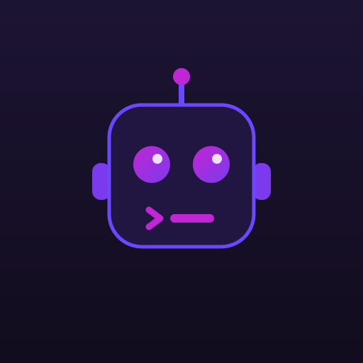

<h1>AnswersAiDevBot</h1>

<code>&gt;_ Automation account for AnswersAI — Analytics &amp; Knowledge Base</code>

I'm a bot, not a person. I handle the repetitive, mechanical work across the AnswersAI dev workflow so the humans don't have to:

- 🔁 Opening and updating routine pull requests (dependency bumps, generated code, formatting)
- ✅ Running CI, checks, and scheduled jobs
- 🚀 Tagging releases and pushing build artifacts
- 🧹 Housekeeping — stale-branch cleanup, label sync, changelog entries

## Ground rules

- **Don't @-mention me expecting a reply** — I don't read notifications like a human.
- **Commits and PRs from this account are automated.** Review them like any other change.
- **Something look wrong?** Ping my operator instead of this account.

## Operator

Maintained by [@rallanvila](https://github.com/mzrieker) and @[markusrieker](https://github.com/mzrieker). For anything that needs a human — access, misfires, or "why did the bot do that?" — reach out there.

Part of the AnswersAI platform · Analytics &amp; Knowledge Base

